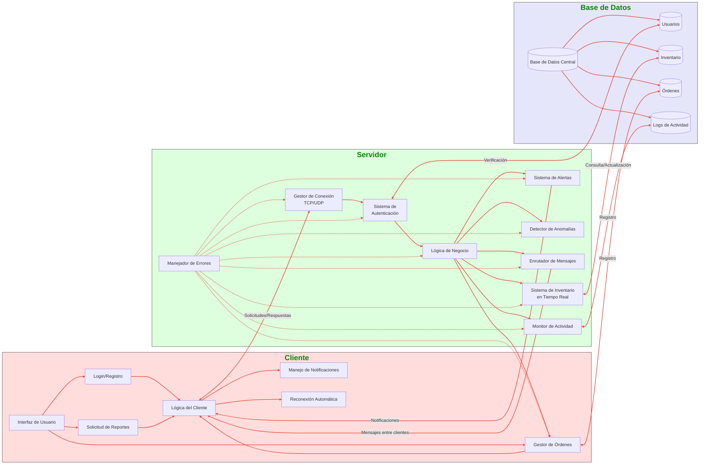

# VAULT-TEC Logistics Service property of TryCatchFF.inc


## Table of Contents
1. [Introduction](#what-is-vault-tec-logistics)
2. [Functional Requirements](#functional-requirements-met-by-our-system)
3. [System Architecture](#system-architecture)
4. [Installation](#project-setup--build-instructions)
5. [Usage](#usage)
6. [Actions](#actions)
7. [License](#license)

## What is VAULT-TEC logistics?

Currently, humanity faces the arduous task of rebuilding civilization from the ashes. In this new world, resources are scarce, technology is vital, and chaos reigns in the streets. In this context, logistics has become the backbone of any attempt to restore order and ensure the survival of communities. To address this challenge, VAULT-TEC Logistics was born, an innovative resource management system designed to optimize logistics operations in an environment of chaos and scarcity.
This system, developed by TryCatchFF.inc, is composed of a client-server architecture that allows communities and factions in the new world to manage the transportation and distribution of essential resources. With a focus on reliability and efficiency, VAULT-TEC Logistics provides users with the ability to track, coordinate, and manage shipments of key materials, such as food, medicine, and critical technology, securely and effectively. Through a centralized platform, VAULT-TEC Logistics servers allow different factions to interact, receive real-time information on the status of their shipments, and optimize their distribution routes. The system is designed to operate even in the most extreme conditions, where communication is intermittent and resources are limited.


## **VAULT-TEC Logistics**: The Key to Survival and Reconstruction

> It is not just a logistics management system: it is an essential tool for the survival and reconstruction of civilization, designed to ensure that resources reach where they are most needed, regardless of the difficulties that may arise along the way.


## Functional Requirements Met by Our System
1. User login.
2. New user registration.
3. Real-time inventory update.
4. Generation of alerts by the server.
5. Detection of abnormalities in storages.
6. The server has an error handler implemented, which is used by the entire system.
7. The server knows exactly the stock of the Warehouses.
8. The server orders the restocking of the storages.
9. The server handles connections by selecting between UDP or TCP protocols to establish the connection.
10. The client must be told whether the connection was successful.
11. A new connection must not be allowed if an active connection already exists.
12. User Authentication.
    - The system must allow a user to log in with email and password.
    - The system must allow a new user to register (sign in).
    - The user must be able to log out and disconnect from the server.
13. The client can request a report of which customers are connected, so that he knows where he can place an order.
14. The client can ask the server for a report of the orders that have been placed in the last hours.
15. The server provides the client with a user interface to perform its activities.
16. The system has full control over orders, rejecting those that do not meet certain requirements, such as an excess quantity.
17. The server has the ability to delete the connection and session of inactive clients.
18. The server keeps a log of connected clients to know how to redirect messages.
19. Clients have the ability to receive messages from other clients, which are forwarded by the server.
20. Clients receive messages that their orders have been delivered.
21. In case the server shuts down at some point, the clients have the ability to handle that by retrying every so often.
22. Customers can initiate supply requests, specifying the urgency, quantity and type of resources.

## System architecture



## Project Setup & Build Instructions

This guide explains how to set up, build, and test the VAULT-TEC Logistics system.

---

### 📦 Prerequisites
Make sure you have the following installed:

- **Conan** (for dependency management)
- **CMake** (for project configuration)
- **Make** (for building the project)
- **GCC or Clang** (for compiling C++ code)

---

### 🔧 Setup & Installation

Follow these steps to install dependencies and build the project:

### 1️⃣ Activate Conan Environment
```bash
source conan_env/bin/activate
```

### 2️⃣ Install Dependencies with Conan
```bash
conan install . --output-folder=build --build=missing
```

### 3️⃣ Deactivate Conan Environment
```bash
deactivate
```

### 4️⃣ Verify Build Directory
Run the following command to ensure the `build` folder was created:
```bash
ls
```
You should see a `build` directory.

### 5️⃣ Run CMake Configuration
```bash
cmake .. -DCMAKE_TOOLCHAIN_FILE=/build/Release/generators/conan_toolchain.cmake -DCMAKE_BUILD_TYPE=Release
```

### 6️⃣ Compile the Project
```bash
make -j$(nproc)
```
This will generate the necessary executables.

---

### ✅ Running Tests & Generating Coverage Report

### Run Tests
```bash
make run-tests
```

### Generate Code Coverage Report
```bash
make coverage
```

The coverage report will be available in the `out/` directory.

---

### Docker for Database

### Go to docker path
```bash
cd /docker
```

### Turn up the container
```bash
docker compose down -d # if not the first time and then
docker compose up -d
```

### Run database with docker
```bash
docker exec -it manage_mysql mysql -uroot -proot manage_system
```

## Usage

### Running Server
```bash
./server
```
### Running Clients
```bash
./client
```

## Actions 

### Install ACT
https://github.com/nektos/act

### Running ACT locally
```bash
act workflow_dispatch -P ubuntu-latest=catthehacker/ubuntu:act-latest
```

Our Actions
---


## License
This project is licensed under the MIT License.

> © 2025 TryCatchFF.inc. ALL RIGHTS RESERVED.

